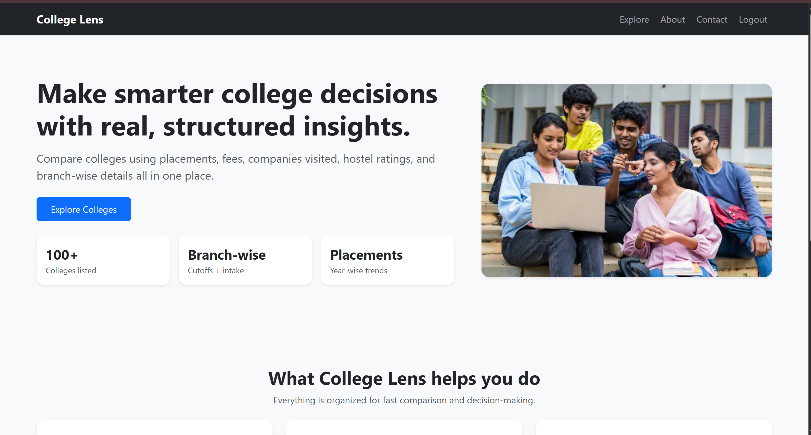
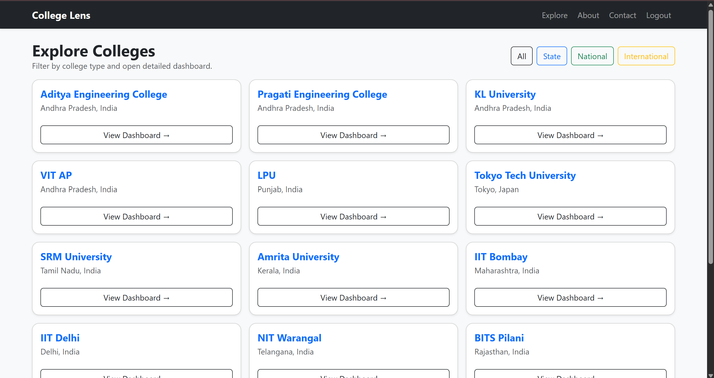
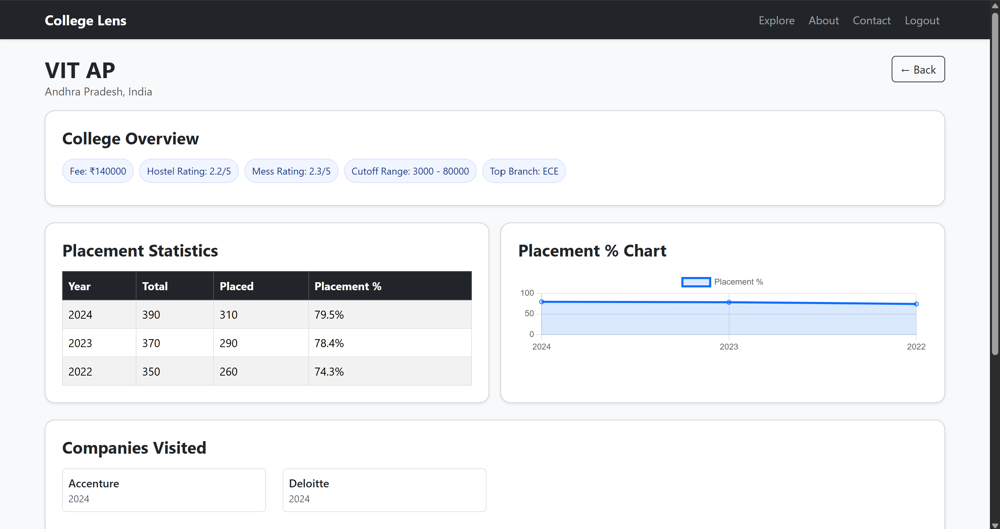
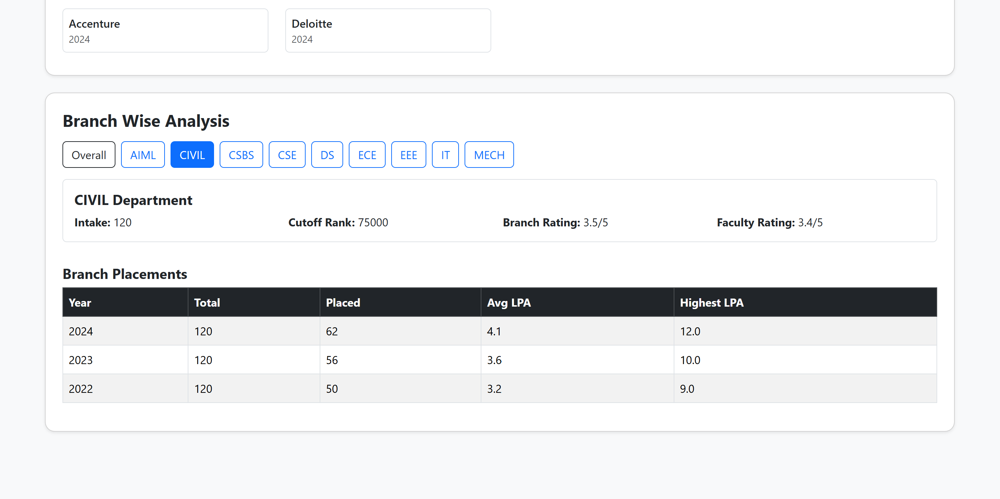

# College Lens
A Flask-based web application that helps students analyze colleges quickly before joining.  
It provides college overview, placements, companies visited, and branch-wise analysis.

---
## Features

- User Authentication (Signup / Login / Logout)
- Explore Colleges with filters (State / National / International)
- College Dashboard:
  - Placement statistics (year-wise)
  - Placement percentage chart (Chart.js)
  - Companies visited
  - College details (fee, hostel, cutoff, top branch)
- Branch-wise analysis (clickable buttons)
  - Intake, cutoff rank, ratings
  - Branch-wise placements (avg + highest package)

---

## Tech Stack

**Frontend**
- HTML
- Bootstrap 5
- Jinja2 Templates

**Backend**
- Python
- Flask

**Database**
- SQLite3

---

## Project Folder Structure

```
FlaskWeb/
│── app.py
│── schema.sql
│── requirements.txt
│── Procfile
│── README.md
│── database/
│ └── app.db
│── templates/
│── static/

```
---

## Installation & Setup (Local)

### 1) Create virtual environment
```bash
python -m venv venv
```
### 2) Activate venv
```
venv\Scripts\activate
```
### 3) Install dependencies
```
pip install -r requirements.txt
```
### 4) Initialize database
```
python init_db.py
```
### 5) Insert dummy data
```
python add_sample_data.py
```
### 6) Run Flask app
```
python app.py
```
### Open:
```
http://127.0.0.1:5000
```

## Screenshots

### HomePage


### ExplorePage


### CollegeDetailsPage


### Branchwise Analysis

> Note: All data shown is dummy/sample data for demo purposes.


## Deployment (Render)
### Required files
### Procfile
```
web: gunicorn app:app
```
### requirements.txt
```
Flask
Werkzeug
gunicorn
```

### Future Improvements
- Replace SQLite with PostgreSQL

- Add Admin panel for adding colleges & placements

- Search bar and sorting filters

- Better UI cards and animations

- API version for React frontend

## Author
Name: Bojja Siva Sai Prasanna Rameswari

Project: College Lens

